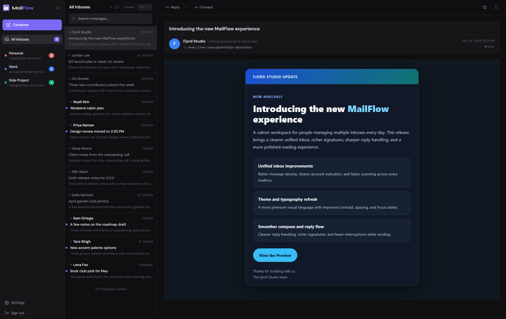
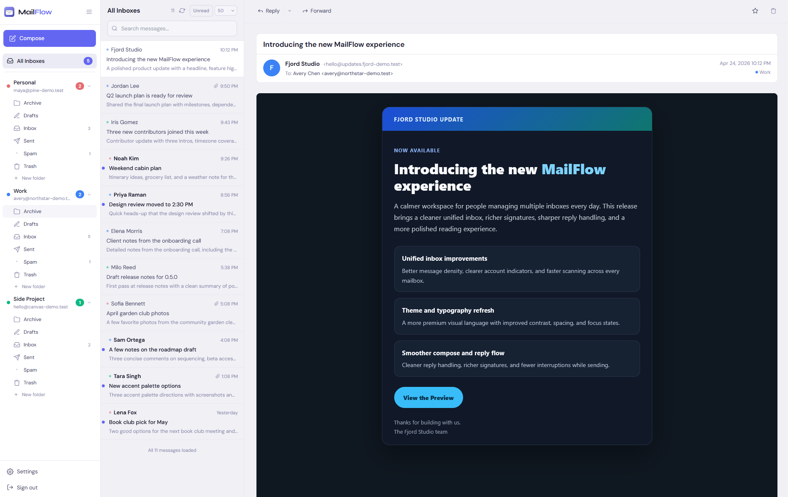
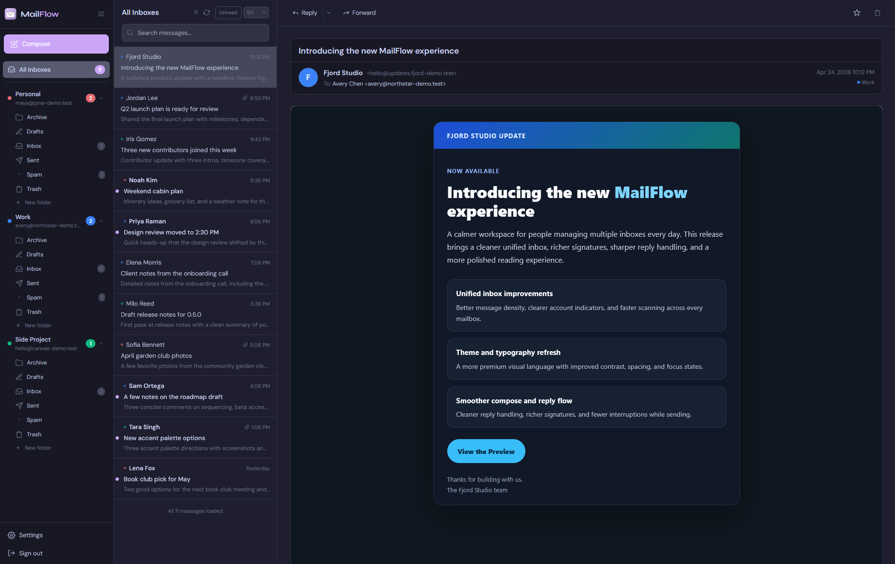
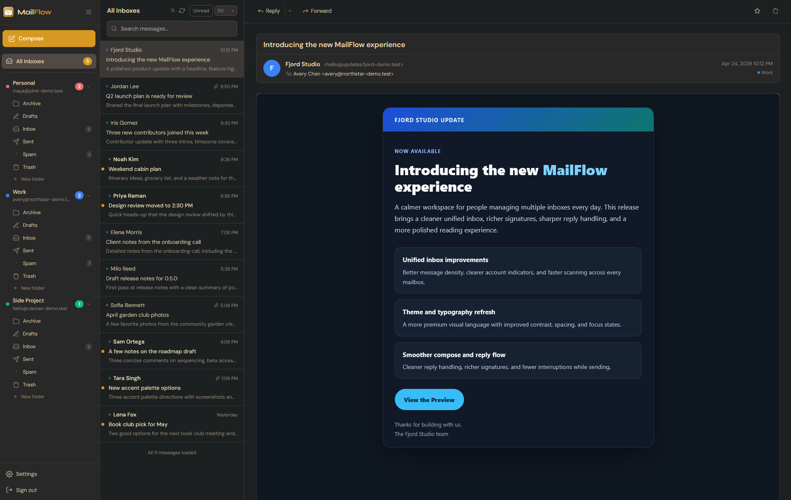
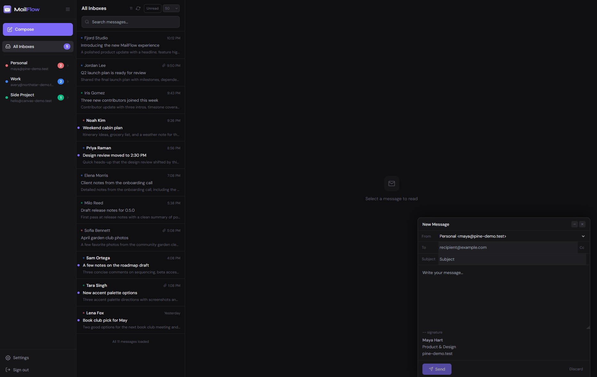
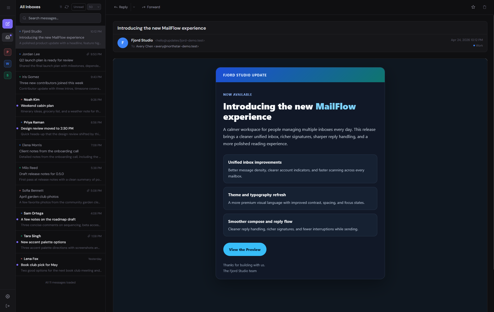
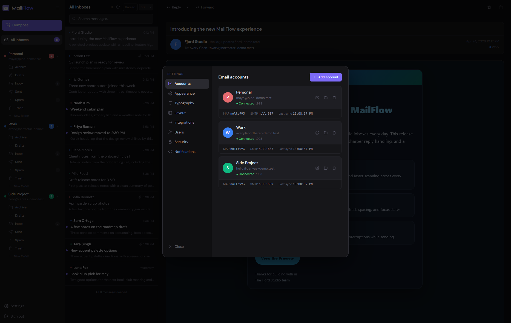
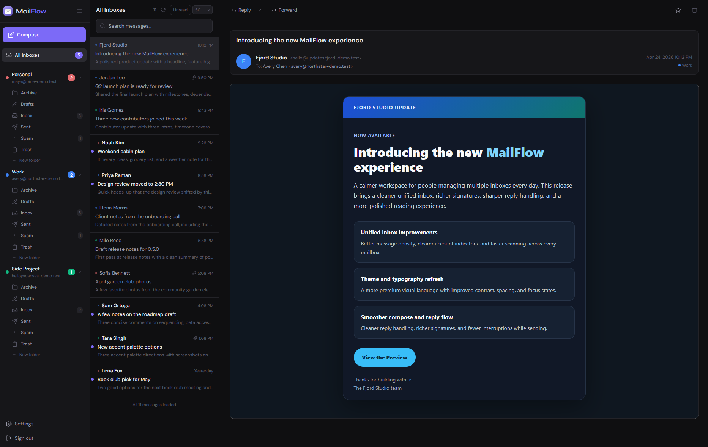
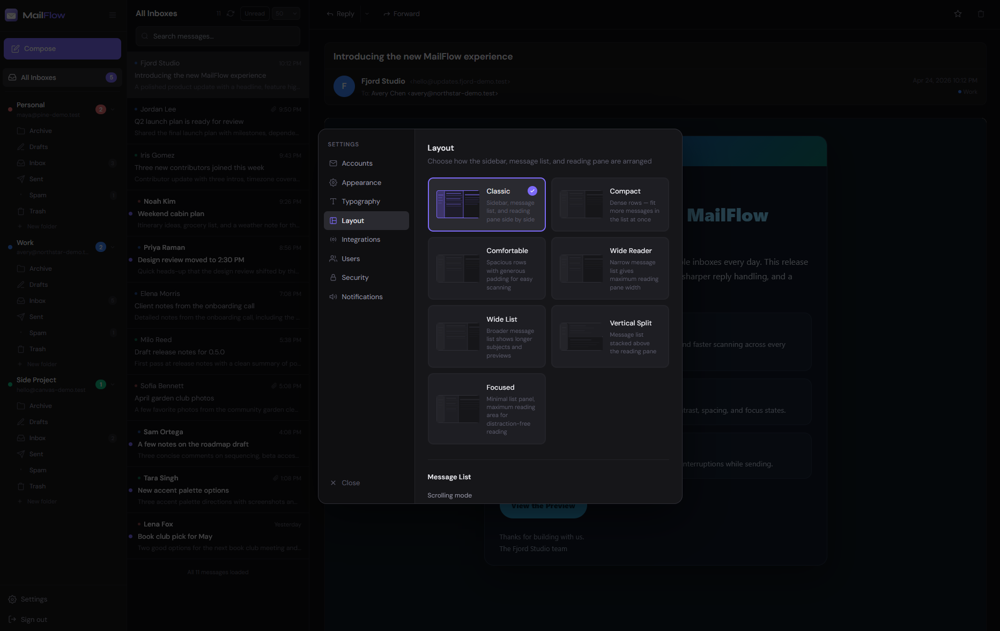
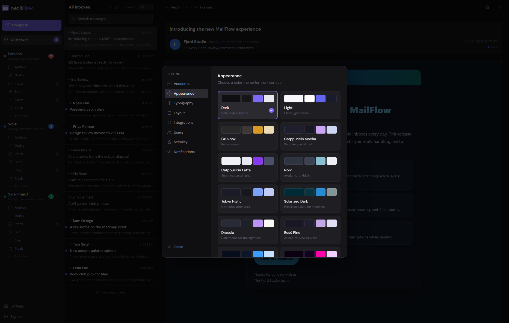

<p align="center">
  
</p>

# MailFlow

A self-hosted, unified webmail client. Connect multiple IMAP/SMTP accounts (Gmail, iCloud,
Outlook, custom) and read them all in one clean interface.

This software is in beta — you may encounter issues. Please open an issue [here](https://github.com/maathimself/mailflow/issues)
if you do. See the [Security Notes](https://github.com/maathimself/mailflow/tree/main?tab=readme-ov-file#security-notes)
section before deploying.

## Licensing

MailFlow is dual-licensed:

- **[AGPL-3.0](LICENSE)** — free for personal use, self-hosting, and open-source projects. If you modify and distribute or host MailFlow, you must publish your changes under the same license.
- **[Commercial License](LICENSE-COMMERCIAL)** — $500 per installation, one-time. For businesses or deployments where AGPL obligations cannot be met. [Purchase here](https://mailflow.sh/#pricing).

**Personal self-hosting is free and always will be.** This licensing model exists to protect the project from commercial exploitation while keeping MailFlow freely available to individuals and families.

If you contribute code, please read the [Contributor License Agreement](CLA.md). By submitting a pull request you agree to its terms.


## Features

- **Unified inbox** — all accounts merged in one view, sorted by date
- **Multiple layouts** — classic, compact, wide reader, vertical split, and more
- **Multiple themes** — dark, light, and several color schemes
- **Full-text search** — across all connected accounts simultaneously
- **Real-time notifications** — WebSocket-powered new-mail toasts
- **Reply / Forward / Compose** — correct per-account SMTP routing
- **Folder navigation** — expand any account to browse folders
- **Star, delete, mark read** — synced back to IMAP
- **User management** — admin panel, invite-only registration, invite emails
- **Microsoft 365 / OAuth2** — for work accounts that require modern auth

---

## Screenshots

<table>
  <tr>
    <td align="center"><br><sub>Default dark theme</sub></td>
    <td align="center"><br><sub>Light theme</sub></td>
  </tr>
  <tr>
    <td align="center"><br><sub>Catppuccin theme</sub></td>
    <td align="center"><br><sub>Gruvbox theme</sub></td>
  </tr>
  <tr>
    <td align="center"><br><sub>Compose window</sub></td>
    <td align="center"><br><sub>Collapsed sidebar</sub></td>
  </tr>
  <tr>
    <td align="center"><br><sub>Account management</sub></td>
    <td align="center"><br><sub>Folder navigation</sub></td>
  </tr>
  <tr>
    <td align="center"><br><sub>Layout options</sub></td>
    <td align="center"><br><sub>Appearance settings</sub></td>
  </tr>
</table>

---

## Installation

There are two ways to run MailFlow. The pre-built image method is recommended for most users.

---

## Option A — Pre-built images (recommended)

No cloning or building required. Docker pulls the pre-built images directly from GHCR.

### Prerequisites

- A server with Docker and Docker Compose installed

### 1. Download the compose file and default config

```bash
curl -o docker-compose.yml https://raw.githubusercontent.com/maathimself/mailflow/main/docker-compose.ghcr.yml
curl -o .env               https://raw.githubusercontent.com/maathimself/mailflow/main/.env.example
```

### 2. Configure environment

Edit `.env` — the required fields are:

| Variable | Description |
|---|---|
| `APP_URL` | Full URL, e.g. `https://mail.example.com` |
| `SESSION_SECRET` | `openssl rand -hex 32` |
| `DB_PASSWORD` | `openssl rand -hex 16` |
| `ENCRYPTION_KEY` | `openssl rand -hex 32` |

### 3. Start

```bash
docker compose up -d
```

MailFlow will be available on port 443 with a self-signed certificate.

**Optional — automatic HTTPS via Let's Encrypt:** set `DOMAIN` and `ACME_EMAIL` in `.env`,
remove the `ports:` block from the `frontend` service, then start with:

```bash
docker compose --profile https up -d
```

### 4. Create your admin account

Open `https://your-domain.com` in a browser. The **first account registered becomes
the admin**. After registering, you can close registration and manage users from the
settings panel → Users tab.

### 5. Add your email accounts

In the settings panel → Accounts → Add Account.
Select a preset (Gmail, iCloud) or Custom for any IMAP server.

### Updating

```bash
docker compose pull
docker compose up -d
```

To pin to a specific version instead of `latest`, add `MAILFLOW_VERSION=0.7.0` to your `.env`.

---

## Option B — Build from source

### Prerequisites

- A server with Docker and Docker Compose installed

### 1. Get the code

```bash
git clone https://github.com/maathimself/mailflow.git mailflow
cd mailflow
```

### 2. Configure environment

```bash
cp .env.example .env
```

Edit `.env` — the required fields are:

| Variable | Description |
|---|---|
| `APP_URL` | Full URL, e.g. `https://mail.example.com` |
| `SESSION_SECRET` | `openssl rand -hex 32` |
| `DB_PASSWORD` | `openssl rand -hex 16` |
| `ENCRYPTION_KEY` | `openssl rand -hex 32` |
| `ACME_EMAIL` | Email for Let's Encrypt notifications |

### 3. Build and start

```bash
docker compose up -d --build
```

First build takes 2–3 minutes. Caddy will automatically obtain a TLS certificate
from Let's Encrypt — this takes a few seconds on first start and renews automatically.

### 4. Create your admin account

Open `https://your-domain.com` in a browser. The **first account registered becomes
the admin**. After registering, you can close registration and manage users from the
settings panel → Users tab.

### 5. Add your email accounts

In the settings panel → Accounts → Add Account.
Select a preset (Gmail, iCloud) or Custom for any IMAP server.

---

## Email Provider Setup

### Gmail

Gmail requires an **App Password** (not your normal password):

1. Enable 2-step verification on your Google account
2. Go to [myaccount.google.com/apppasswords](https://myaccount.google.com/apppasswords)
3. Create a new App Password — name it "MailFlow"
4. Use the 16-character password in the MailFlow account form

| Setting | Value |
|---|---|
| IMAP Host | `imap.gmail.com` |
| IMAP Port | `993` |
| SMTP Host | `smtp.gmail.com` |
| SMTP Port | `587` |
| Username | your Gmail address |

### iCloud / Apple Mail

1. Go to [appleid.apple.com](https://appleid.apple.com) → Sign-In and Security → App-Specific Passwords
2. Generate a password — name it "MailFlow"

| Setting | Value |
|---|---|
| IMAP Host | `imap.mail.me.com` |
| IMAP Port | `993` |
| SMTP Host | `smtp.mail.me.com` |
| SMTP Port | `587` |
| Username | your full iCloud email (`you@icloud.com`) |

### Microsoft 365 / Outlook (OAuth2)

Work/school accounts that require modern authentication:

1. In MailFlow settings → Integrations → Microsoft 365 — follow the Azure App
   Registration instructions shown there
2. After saving the config, click **Connect Microsoft account**

### Custom IMAP

Any standard IMAP/SMTP server works. Use port 993 for IMAP (TLS) and
587 (STARTTLS) or 465 (TLS) for SMTP.

---

## Management

```bash
# View all logs
docker compose logs -f

# View backend logs only
docker compose logs -f backend

# Stop
docker compose down

# Stop and delete all data (destructive)
docker compose down -v

# Update to latest images (pre-built install)
docker compose pull && docker compose up -d

# Rebuild after a code change (build-from-source install)
docker compose up -d --build
```

## Backup and Restore

```bash
# Backup database
docker exec mailflow-postgres pg_dump -U mailflow mailflow \
  > mailflow-$(date +%Y%m%d).sql

# Restore database
cat mailflow-YYYYMMDD.sql | \
  docker exec -i mailflow-postgres psql -U mailflow -d mailflow
```

---

## Architecture

```
Browser (HTTPS)
  │
  ▼
Caddy  (ports 80/443 — TLS termination, auto Let's Encrypt)
  │
  ▼
nginx  (frontend container — React SPA + API proxy)
  │
  ├── /api/*  → Node.js backend (port 3000)
  ├── /oauth/ → Node.js backend (port 3000)
  └── /ws     → Node.js backend WebSocket (port 3000)
                    │
                    ├── PostgreSQL  (messages, accounts, users)
                    ├── Redis       (sessions)
                    └── IMAP        (outbound to mail servers)
```

Only Caddy is exposed publicly (ports 80/443). All other containers communicate
on an internal Docker network.

## Security notes

- The first registered user becomes the admin automatically
- Close open registration in Settings → Users once you've set up your accounts
- Use the invite system to onboard additional users
- Enable two-factor authentication (TOTP) in Settings → Security for extra account protection
- Session cookies are `HttpOnly`, `Secure`, `SameSite=Lax` with a 7-day TTL
- Passwords are bcrypt-hashed (cost factor 12)
- Login and registration endpoints are rate-limited (10 attempts per 15 minutes per IP)
- Database and Redis are not exposed outside the Docker network
- IMAP/SMTP credentials are stored at rest in the database (standard for webmail clients — protect access to your server and database volume accordingly)
